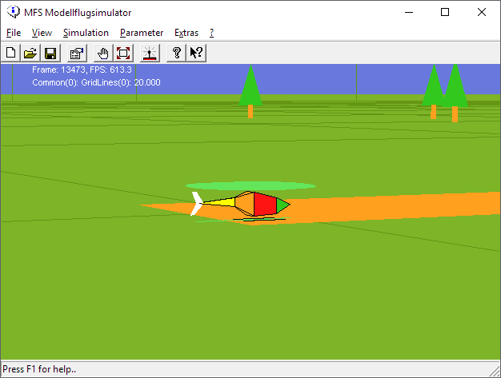

# MFS Modellflugsimulator '98 Edition

MFS98 was my fourth version of a 3D R/C helicopter simulator for the PC. It was written in 1998 for [Windows 95](https://en.wikipedia.org/wiki/Windows_95).

Enhancements to the previous version [MFS96](https://github.com/mariusgreuel/mfs96) include
- Support for Windows 95 and Windows NT 4.0 via DirectDraw
- Support for an external R/C transmitter via a Windows 95 [VXD driver](https://en.wikipedia.org/wiki/VxD) or a [Windows NT driver](https://en.wikipedia.org/wiki/Windows_NT_Driver_Model)
- Wireframe skybox and shadow for better orientation

To compile the project, you need Microsoft Visual Studio 6.0. Precompiled binaries can be found in the bin folder.

## Screenshot

Surprisingly, MFS98 is still functional under Windows 10...

## System Requirements

- A Windows PC with a VGA graphics card
- A R/C transmitter with the PPM signal connected to a serial ports CTS pin

## License

MFS98 is released under the GNU GPLv2.

Copyright (C) 1998 Marius Greuel. All rights reserved.
